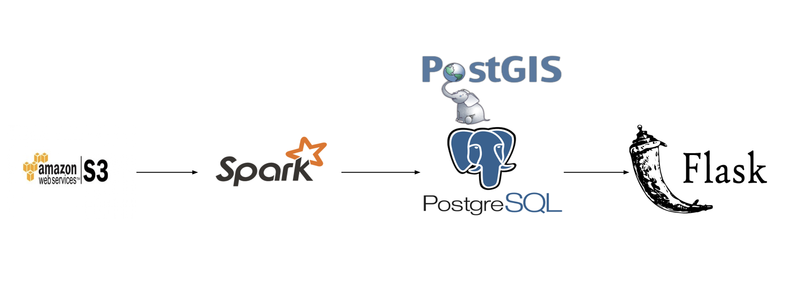

# StayHere

The goal of my project was to develop a data pipeline and Web platform for people to easily find a suitable airbnb close to high rated yelp business.

Screencast: https://youtu.be/-Pr9FYJc3eA

### Introduction

When you plan your travel, there're several questions one want to get an immediate answer: Where do I stay? What can I do there? Is my destinations close to my accommodation? Different websites are experts in different areas and they have tons of information. However it may take you lots of time to search in between. 

## Data pipeline

### Data Extraction

Airbnb data is available on [Inside Airbnb](http://insideairbnb.com/get-the-data.html). You can download yelp dataset from [Kaggle](https://www.kaggle.com/yelp-dataset/yelp-dataset). Data is updated monthly. Data extraction includes uploading raw data to Amazon S3, and loading it to Spark.

### Data Processing
There're two major steps of data processing in this project. First is to build a relationship between every single category and yelp business since in yelp dataset `categories` column, one value is a string including several categories. Two table were created in postgres: one table contains all the category names, another table `yelp2category` is the mapping between yelp and category. Second is to caculate a score to rank airbnb listings. After finding out all the business that falls under a certain category within 500 meters around the listing, then calculate a score, giving 1000 to 5 stars, 100 to 4.5 stars, 10 to 4 stars, 1 to 3.5 stars. PostGIS extension is used to index the geography address of yelp business, and to compute distance.

### Data Storage

Cleaned and proceesed data is stored in Postgres.

### Engineering Challenge
**Heterogeneous Dataset**

There’s no one single dataset that can answer this particular question, two seperate dataset are used to solve this question. 

**Calculation**

There're over 300 million unique combinations of locations need to be calculated. PostGIS is used to calculate the distance between airbnb and yelp business location. 

### Steps

1. Stored data in S3

2. Load data to Spark batch jobs, use PostGIS to query distance between airbnb and yelp business, calculate a score based on yelp business stars and rank.

3. Store data in Postgres.

4. Use Flask for user interface

